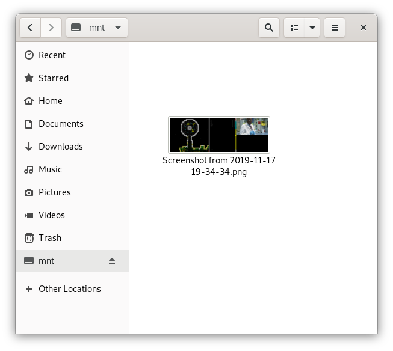

SSHFS: Mounting a remote filesystem over SSH
============================================

SSHFS is a client tool for mounting a remote filesystem from another server locally on your machine, over an SSH connection.  SSHFS is a FUSE(1) filesystem that uses SFTP (SSH File Transfer Protocol) to mount a remote filesystem.

While not as performant as a local filesystem, using SSHFS is an easy way to work with files on another computer using local programs and tools.

Best of all, it can be used by non-privileged users on the local machine (in fact, it is recommended to NOT be root or to elevate one's privileges while using SSHFS), and it requires no special software on the remove machine other than SSH with SFTP enabled - a very common setup.

Getting Started: Installing SSHFS
---------------------------------

SSHFS is available from the standard repositories for most distributions, and is most easily installed using that distribution's package manager.

For Fedora, installing SSHFS is as easy as: `dnf install fuse-sshfs`.  On Debian-based systems, the package is simply "sshfs".

Mounting a remote filesystem
----------------------------

Once SSHFS is installed, mounting a remote filesystem safely over SSH is simple.  According to the SSHFS manual page (`man sshfs`), the syntax for the command is:

`sshfs [user@]host:[dir] mountpoint [options]`

That should look familiar to anyone who has used SSH or SCP before.

Let's take a look at SSHFS in action.  First, create (or select an existing) directory to use as a mountpoint.  Note that the local user invoking the `sshfs` command must have write access to the mountpoint.  As use of the root account is discouraged, that may make something like `~/mnt` preferable to `/mnt`.  Then, it is just a matter of using the `sshfs` command to connect to the remote machine using your SSH credentials, and specifying which remote location to mount to the mountpoint.

```sh
# Create the mountpoint
[chris@marvin ~ ]$ mkdir ~/mnt

# Invoke SSHFS with your SSH credentials and the remote location to mount
[chris@marvin ~ ]$ sshfs chris@zaphod:/home/chris/Pictures ~/mnt

# Access the newly mounted filesystem
[chris@marvin ~ ]$ ls ~/mnt/
'Screenshot from 2019-11-17 19-34-34.png'
```
_Exciting Pictures directory I have, huh?_

Fun fact, sshfs doesn't expand `~` on the remote machine to the user's homedir.

The mounted filesystems can be access and used the same way a local filesystem is, both from the commandline or using other tools:



_Not any more exciting than before, but it does show off my choice of passtimes.  Dwarf Fortress, anyone?_

When you're done with the remote filesystem, it can be unmounted with the `fusermount` command:

```sh
# Unmount the remote FS
fusermount -u ~/mnt
```

Options
-------

For most cases, the default SSHFS command can be used as is, but SSHFS is far from a simple command.  There are tons of options and flags that can be used to work with a variety of situations, including SSH and SFTP options, compression, etc.  Check out the SSHFS manual (`man sshfs`) for more details on what is available.

One of the most useful, however, is the reconnect option, which allows the client to reestablish the connection to the remote system if the connection is interrupted for some reason:

```sh
# Use "-o reconect" to allow the client to reconnect
sshfs chris@zaphod:/home/chris/Pictures ~/mnt -o reconnect
```

Mounting a remote filesystem on startup
---------------------------------------

SSHFS can also be used in the client system's `/etc/fstab` file to automatically mount the remote filesystem.  The normal FSTAB syntax is used, including any options required, and `sshfs` is used in place of the filesystem type:

```txt
# file: /etc/fstab
chris@zaphod:/home/chris/Pictures /home/chris/mnt sshfs
```

Note that using SSHFS with the FSTAB file and mounting the filesystem must be done by root, so appropriate adjustments need to be made for SSH credentials and adequate precautions taken.

"Transport endpoint is not connected"?!
---------------------------------------

In some cases, you may receive a `Transport endpoint is not connected` error when the connection is interrupted (like, say, if the client machine changes networks, or is suspended).

In this case, just unmount the filesystem with the `fustermount` command, as describe above:

```sh
[chris@marvin ~ ]$ ls ~/mnt
ls: cannot access '/home/chris/mnt': Transport endpoint is not connected
[chris@marvin ~ ]$ fusermount -u ~/mnt
```

Hopefully this will have given you the basics needed to work with SSHFS.  It is a great tool for working with remote filesystems, securely over an encrypted SSH connetion, mounted locally on your client computer.  And as mentioned, thanks to SSHFS being a FUSE filesystem, even unprivileged users can use it, without requiring an administrator to set it up!


1. _FUSE stands for Filesystem in Userspace, and is a way that userspace(2) programs can share a filesystem with the Linux kernel._ REF: https://en.wikipedia.org/wiki/Filesystem_in_Userspace

2. _Userspace (or userland) is all operating system code that runs outside of the Kernel._ REF: https://en.wikipedia.org/wiki/User_space
